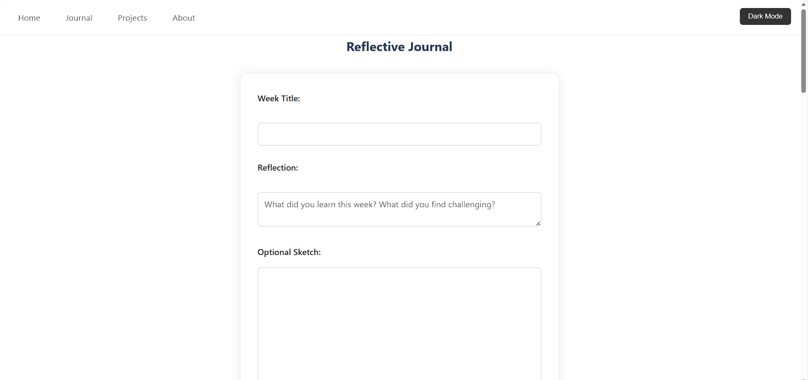
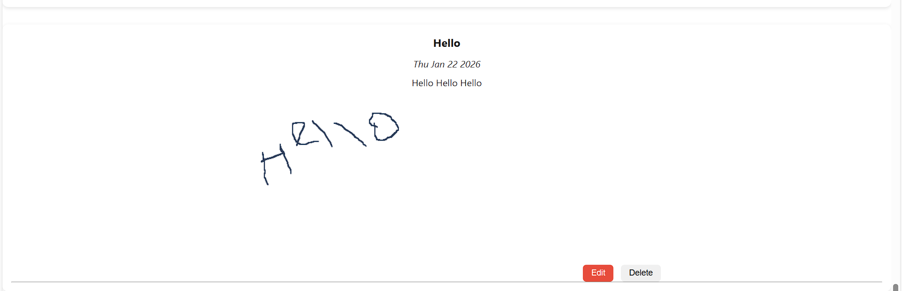
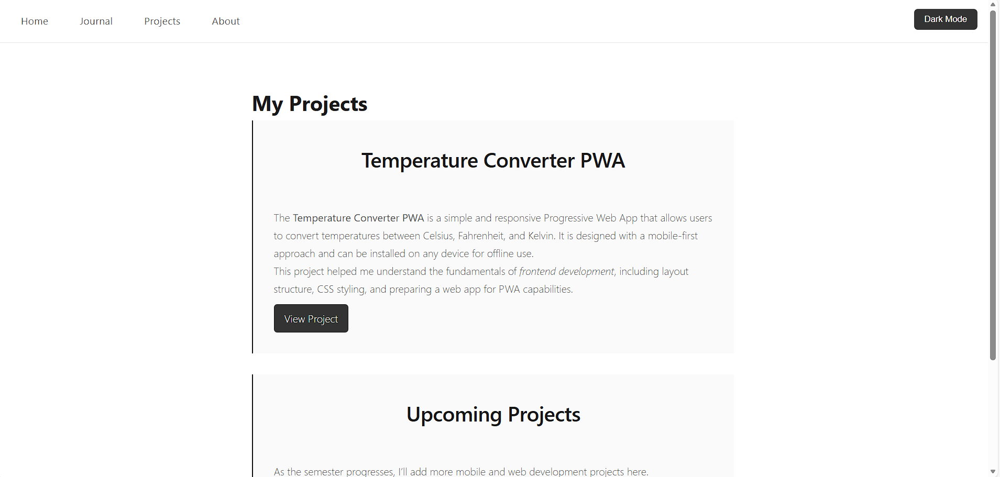
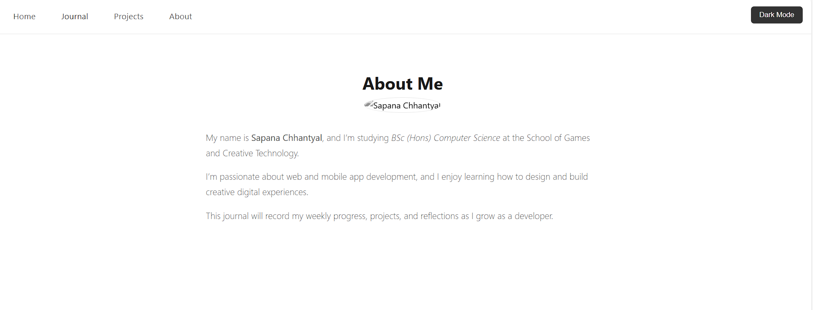

# Learning Journal PWA

**Author:** Sapana Chhantyal
**Course:** FGCT6021 Mobile Application Development  
**University:** University for the Creative Arts  
**Date:** January 2026  

---

## Overview

The Learning Journal PWA is a **progressive web application** designed to help users record and reflect on their weekly learning experiences. It allows text-based reflections, as well as **visual reflections via a Creative Canvas / Sketchboard**, making the journaling process interactive and multimodal. The application demonstrates **full-stack development** concepts, including frontend design, JavaScript interactivity, backend data management with Flask, and offline functionality as a Progressive Web App (PWA).

The aim of this project is to document my development process, showcase my technical skills in frontend and backend integration, and demonstrate the implementation of PWA features such as offline caching, dynamic data loading, and interactive forms. Throughout the project, I have developed skills in HTML5, CSS3, JavaScript, Flask, JSON, and PWA technologies while addressing challenges in responsive design, data persistence, and offline-first applications.

---

## Features

- **Weekly Reflections:** Record, edit, and delete textual reflections.  
- **Creative Canvas / Sketchboard:** Draw visual reflections with HTML5 Canvas; sketches are saved as **Base64 images** alongside text.  
- **Dynamic Loading:** Reflections display instantly after submission without page reload.  
- **Offline Access:** Service worker caches assets for offline use.  
- **Theme Toggle:** Switch between light and dark mode, with preference saved in localStorage.  
- **Reflection Counter:** Shows the total number of journal entries.  
- **Export Options (Optional):** Ability to download sketches as PNG images.  

---

## Technologies Used

- **Frontend:** HTML5, CSS3, JavaScript (ES6), HTML5 Canvas API  
- **Backend:** Python 3, Flask, JSON file storage  
- **PWA Features:** Manifest file, service worker, Cache Storage API  
- **Version Control & Deployment:** GitHub, GitHub Pages, PythonAnywhere  

---

## Installation & Setup

1. **Clone the repository:**

```bash
git clone https://github.com/chhantyalsapana040-spec/learning-journal-pwa.git
cd learning-journal-pwa
```

2. **Install Python dependencies if running locally**

```bash
python -m venv venv
source venv/bin/activate  # On Windows: venv\Scripts\activate
pip install flask
```

3. **Run the flask server**

```bash
export FLASK_APP=flask_app.py  # Windows: set FLASK_APP=flask_app.py
flask run
```

**Deployment Link:**

```bash
PythonAnywhere: https://sapanachhantyal.pythonanywhere.com/
```

**Project Structure**

```bash
learning-journal-pwa/
│
├─ static/
│   ├─ css/
│   ├─ js/
│   ├─ manifest.json
│   └─ sw.js
│
├─ templates/
│   ├─ index.html
│   ├─ reflections.html
│   └─ about.html
│
├─ flask_app.py
├─ reflections.json
└─ README.md
```

**How it works**
- At the end of each week, users complete a reflection form where they can choose to draw or not draw on the Canvas.
- When submitted, the reflection and the sketch (Base64 version) are stored through Flask API in reflections.json.
- The app automatically loads the Previous Reflections page without reloading the page.
- It provides offline functionality through service worker caching and localStorage.
- Users can turn on/off light/dark mode and a reflection counter which tracks user progress.

License
This project is for academic purposes at the University for the Creative Arts. © 2026 Sapana Chhantyal.

Acknowledgements
- OpenAI ChatGPT for grammar and paraphrasing assistance
- HTML5 Canvas API documentation
- Flask documentation and tutorials
- UCA library resources for web and mobile development

**Screenshots**








